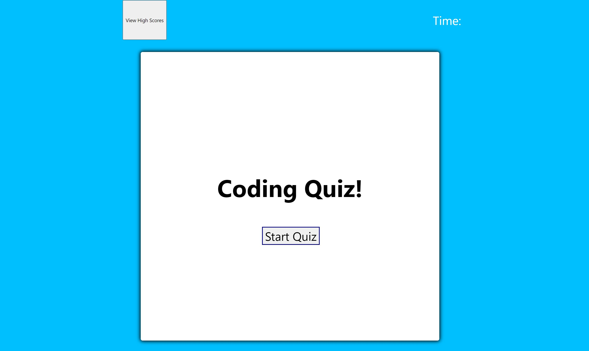

# Coding Quiz 

## Image

## Application Link 
[WebPage](https://mkelly3.github.io/TimedQuiz/)

## Description
This application tests the users knowledge about CSS, HTML and Javascript. The quiz ends once the user answers all of the questions or if time runs out. Once the quiz is over the user is able to save their score and initials and view previous high scores. 

## Technologies Used 
- JavaScript
- HTML
- CSS
- Git
- GitHub

## Author Links
- [GitHub](https://github.com/mkelly3/)
- [Linkedin](https://www.linkedin.com/in/morgan-kelly15/)